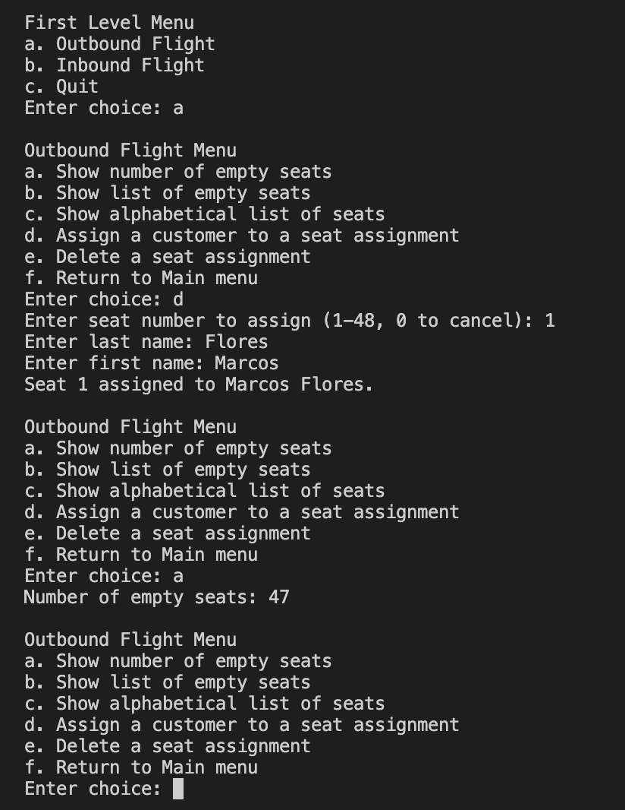
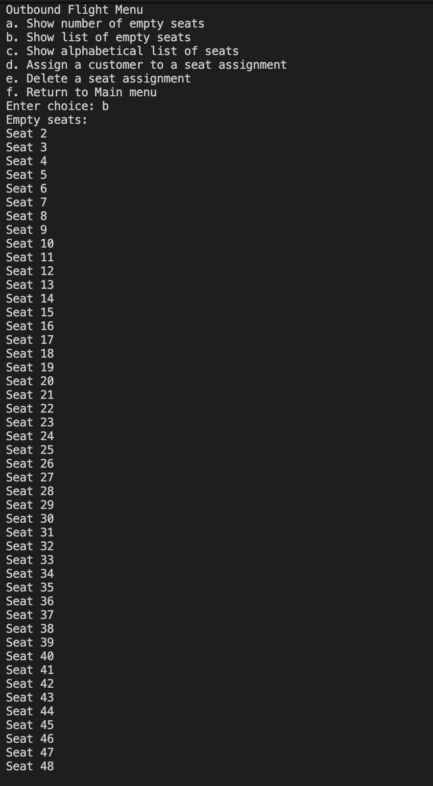
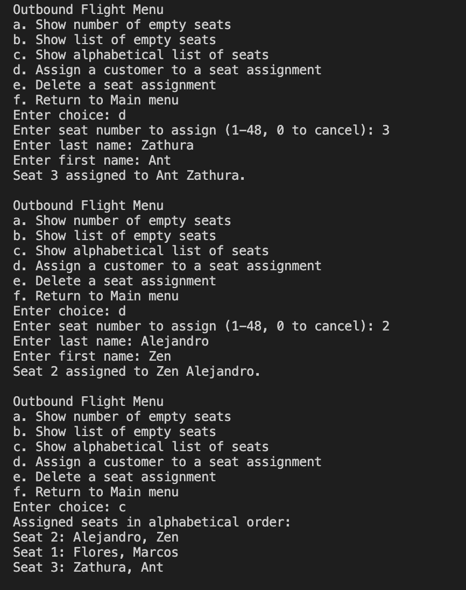
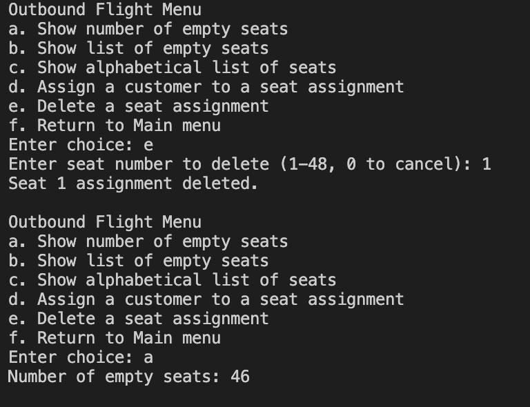

# Programming Assignment 3

## Problem Statement:
This program simulates a seating reservation system for an airline with 48 seats. There are two flights (outbound and inbound) and each one keeps track of seat assignments. The program lets the user view empty seats, assign a seat, delete a seat, and see a list of assigned seats in alphabetical order.

## Describe the Solution:
I used an array of structures to store the seat information. Each seat keeps track of the seat number, whether it is assigned, and the passenger’s first and last name.

The program has two menus. The first menu lets you choose between outbound and inbound flights. The second menu has all the options like showing empty seats, assigning seats, deleting seats, and sorting.

For the alphabetical list, I used a sorting approach to order the assigned seats by last name. The program keeps looping through the menu until the user chooses to quit.

## Pros and Cons of your solution:
Pros  
Easy to follow  
Uses structures and arrays 
Menus make it user friendly  
Handles canceling input 

Cons  
Sorting not efficient   
Limited error checking for user input  
Only works in terminal no UI  

## Screenshots:
### Assign + Count

### Empty Seats

### Alphabetical List

### Delete Seat

